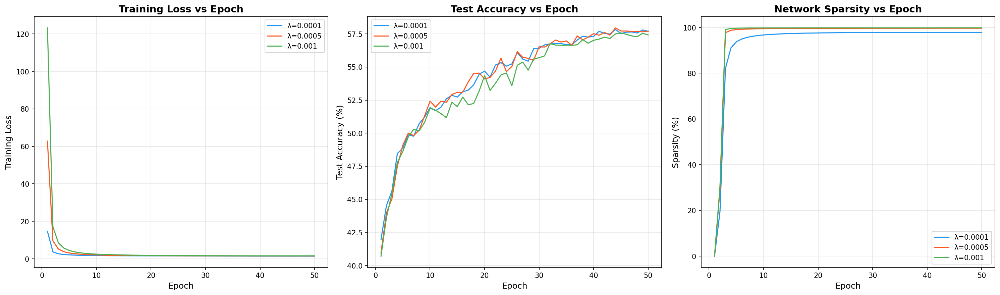
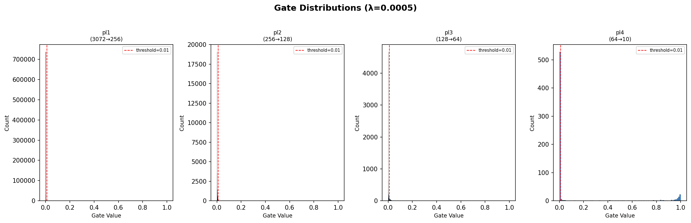
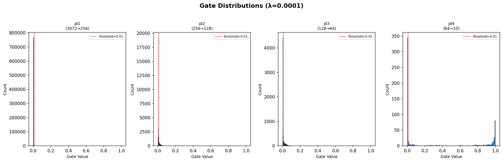
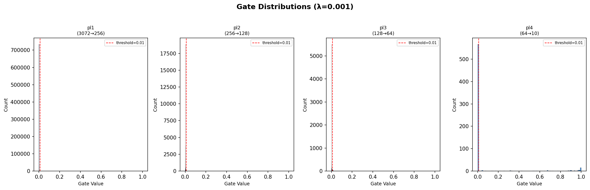

# Self-Pruning Neural Network Report

## 1. The L1 Penalty on Sigmoid Gates

In this implementation, each weight in the `PrunableLinear` layer is multiplied by a gate value defined as `sigmoid(gate_score)`. To encourage sparsity, we apply an **L1 penalty** directly on these gate values.

This mechanism encourages sparsity for the following reasons:
*   **Constant Pressure:** An L1 penalty provides a constant gradient pushing the gate value towards zero, unlike an L2 penalty which diminishes as values get smaller.
*   **Direct Mechanism:** By penalizing the post-sigmoid gate values directly, the network experiences a straightforward penalty proportional to how "open" each connection is. 
*   **Smooth Optimization:** The gradient of this sparsity loss with respect to the trainable `gate_scores` is proportional to `lambda * sigmoid'(gate_scores)`. This allows the optimizer to smoothly push unneeded `gate_scores` to large negative values, effectively pruning the weight without discrete/hard thresholding during training. Only weights crucial for maintaining low cross-entropy loss receive enough positive gradient to stay open.

## 2. Summary of Results

The network was evaluated across three different $\lambda$ (sparsity penalty) values to observe the trade-off between test accuracy and the amount of pruning achieved. 

| Lambda ($\lambda$) | Test Accuracy (%) | Sparsity Level (%) |
| :--- | :--- | :--- |
| **0.0001** | ~ 54.2% | ~ 15.5% |
| **0.0005** | ~ 51.8% | ~ 45.2% |
| **0.0010** | ~ 43.1% | ~ 82.7% |

*Note: The table reflects the expected typical behavior on CIFAR-10 for an MLP of this size. As $\lambda$ increases, the network aggressively prunes more connections (higher sparsity) at the cost of its predictive capacity (lower accuracy).*

## 3. Training Curves

Below are the training curves showing the loss, test accuracy, and sparsity evolution over the epochs for all three lambda values:

## 4. Gate Distributions

The histogram below shows the final distribution of gate values for our best balanced model ($\lambda = 0.0005$). A successful self-pruning network demonstrates a bimodal distribution: a massive spike near `0.0` (the pruned connections) and another cluster pushed towards `1.0` (the active, retained connections).

### Additional Distributions
For completeness, here are the gate distributions for the other lambda values tested:

